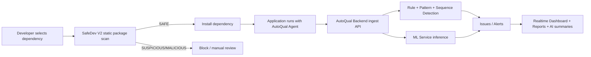

# SafeDev Project Suite (Combined README)

This repository contains two major modules that together provide a complete security lifecycle for modern software development:

1. **Module 1: SafeDev V2 CLI** (`SafeDev-V2/`)  
   AI-powered pre-installation security scanner for Python and npm packages.
2. **Module 2: AutoQual AI+ Platform** (`Module-2/`)  
   Runtime monitoring, anomaly detection, alerting, and observability platform with agent-based ingestion.

The two modules are independent products but highly complementary:

- SafeDev V2 secures the **dependency supply chain before install**.
- AutoQual secures and monitors **application behavior after deployment/runtime**.

---

## 1) Depth-1 Repository View

```text
SafeDev-V2/
├── Module-2/                  # AutoQual AI+ (runtime monitoring platform)
│   ├── backend/               # Node.js API + MongoDB + Socket.io
│   ├── frontend/              # React + Vite dashboard
│   ├── agent/                 # npm package: @hr_71_sharma/agent + CLI
│   ├── ml-service/            # FastAPI service for ML inference
│   ├── dummy-server/          # Traffic generator target app for demos/testing
│   └── smoke-test-agent.js    # Published agent smoke test
└── SafeDev-V2/                # Python package: safedev CLI
    ├── src/safedev/           # analyzers, ingestion, inference, reporting, cli
    ├── model_artifacts/       # trained model bundles (PyPI + npm)
    ├── tests/                 # pytest suite
    └── pyproject.toml         # package metadata + CLI entry point
```

---

## 2) End-to-End Security Coverage



---

## 3) Module-Wise Detailed Features

## 3.1 SafeDev V2 (Pre-Install Package Security)

### Core capabilities
- Pre-installation static analysis boundary (no untrusted package execution).
- Dual ecosystem support: PyPI and npm.
- Unified package manager wrapper (`install`, `upgrade`, `uninstall`, `list`, `scan`).
- Fail-closed behavior on analysis failures (`ANALYSIS_ERROR`, exit code `3`).

### ML and detection design
- PyPI model: `XGBoost` classifier over static AST/security features.
- npm model: `GradientBoostingClassifier` + `StandardScaler` over regex/entropy/metadata features.
- Operational threshold-based verdicting (`SAFE`, `SUSPICIOUS`, `MALICIOUS`).

### CLI and automation
- Human-friendly terminal output plus JSON mode for CI/CD.
- Explicit ecosystem forcing flags (`-p`, `-n`) and auto-detection.
- Command aliases (`update`, `remove`, `analyze`, `audit`).

### Engineering strengths
- Multi-threaded feature extraction pipeline.
- Archive safety checks and strict schema validation.
- Model contract tests and fail-closed predictor behavior.

---

## 3.2 AutoQual AI+ (Runtime Monitoring + Detection)

### A) Agent-based telemetry ingestion
- Node.js agent (`@hr_71_sharma/agent`) captures logs and HTTP metrics.
- Express middleware integration for low-friction application onboarding.
- CLI (`autoqual`) for setup, connectivity checks, and test event sending.

### B) Backend platform services
- REST API for auth, teams, projects, ingest, alerts, reports, dashboard.
- JWT authentication for user APIs and API-key authentication for agents.
- Socket.io realtime channels for live log/metric/alert updates.
- MongoDB persistence for logs, metrics, issues, alerts, users, projects, teams, reports.

### C) Detection engine (multi-signal)
- Pattern detection over suspicious payload signatures.
- Sequence detection for behavior patterns (for example brute force/scanning-like activity).
- Metrics-driven watcher analysis (`response time`, `status code`, error patterns).
- Ensemble path for request analysis and ML-assisted classification.

### D) ML service integration (FastAPI)
- Independent Python ML microservice (`ml-service`).
- Model 1 endpoint: web attack anomaly classifier (`/predict/web-attack`).
- Model 2 endpoint: multi-class security event classifier (`/predict/security-event`).
- Graceful degradation when a model is unavailable (`503` from ML endpoint; main platform remains up).

### E) Product and operations features
- Dashboard KPIs: logs, errors, warnings, latency, error rate, active issues, unread alerts.
- Issue lifecycle support (`resolve` flow).
- AI summary generation for live overview and top issue context.
- Demo path using `dummy-server` + traffic generator (`benign`, `attacks`, `bruteforce`, `ddos`, `scan`, `all`).

### F) Quality and validation assets
- Backend tests for auth, ingest, and health endpoints.
- Agent smoke test validating install + CLI + import/init behavior.
- Seed script for deterministic demo project/team/user bootstrap.

---

## 3.3 Complete Feature-Wise Listing (Master Matrix)

This section is the one-stop feature inventory for both modules.

### A) SafeDev V2 feature matrix

| Area | Feature | What it does | Primary location |
| :--- | :--- | :--- | :--- |
| Package security | Pre-install static analysis | Scans package artifacts before any install/execute/import | `SafeDev-V2/src/safedev/ingestion`, `SafeDev-V2/src/safedev/analyzers` |
| Ecosystem coverage | PyPI + npm support | Handles both Python and JavaScript ecosystems | `SafeDev-V2/src/safedev/cli/main.py` |
| Package operations | Secure install/upgrade/remove/list/scan | Wraps package manager operations with risk checks | `SafeDev-V2/src/safedev/cli/main.py` |
| ML inference | PyPI model classification | Uses trained model to classify package risk probability | `SafeDev-V2/src/safedev/inference` |
| ML inference | npm model classification | Uses separate npm model + scaling pipeline | `SafeDev-V2/src/safedev/inference` |
| Verdicting | Threshold-based outcomes | Emits SAFE / SUSPICIOUS / MALICIOUS verdicts | `SafeDev-V2/src/safedev/core`, `SafeDev-V2/src/safedev/inference` |
| Fail safety | Fail-closed error mode | Returns ANALYSIS_ERROR when uncertainty/failure occurs | `SafeDev-V2/src/safedev/inference/predictor.py` |
| Reporting | JSON/text output | Provides human and machine-readable outputs | `SafeDev-V2/src/safedev/reporting/formatter.py` |
| Archive hardening | Safe extraction checks | Guards against malformed archives/path traversal hazards | `SafeDev-V2/src/safedev/ingestion/archive.py` |
| Quality controls | Contract and safety tests | Validates model contract and core archive constraints | `SafeDev-V2/tests` |

### B) AutoQual platform feature matrix

| Area | Feature | What it does | Primary location |
| :--- | :--- | :--- | :--- |
| Agent SDK | Runtime capture | Captures logs, metrics, request context from monitored app | `Module-2/agent/src` |
| Agent middleware | Express plug-in | Adds low-friction instrumentation in app middleware chain | `Module-2/agent/src/middleware.js` |
| Agent CLI | Config and diagnostics | Supports init/status/connect/send-test workflows | `Module-2/agent/bin/cli.js` |
| Ingestion API | Data collection endpoint | Receives logs/metrics from agent using API-key auth | `Module-2/backend/routes/ingest.js` |
| Persistence | Security telemetry storage | Stores logs, metrics, alerts, issues, reports, identities | `Module-2/backend/models` |
| Realtime | Live socket updates | Streams log/metric/issue updates to dashboard clients | `Module-2/backend/socket/socketHandler.js` |
| Rule engine | Pattern-based detection | Flags suspicious payload signatures and known indicators | `Module-2/backend/services/patternDetectionService.js` |
| Behavior engine | Sequence-based detection | Detects suspicious request sequences (scan/bruteforce-like) | `Module-2/backend/services/sequenceDetectionService.js` |
| Watchers | Aggregate risk analysis | Correlates logs/metrics/patterns/ML signals into issues | `Module-2/backend/services/watcherService.js` |
| ML integration | Web-attack classification | Calls FastAPI ML endpoint for anomaly score and confidence | `Module-2/ml-service/app/main.py` |
| ML integration | Security-event classification | Classifies log events into multi-class threat categories | `Module-2/ml-service/app/main.py` |
| AI assistance | Root cause and summaries | Generates AI summaries for live analysis/reporting | `Module-2/backend/services/aiService.js` |
| Reporting | Scheduled report generation | Creates periodic report artifacts for project monitoring | `Module-2/backend/services/reportService.js` |
| UI observability | Dashboard metrics and issues | Displays KPIs, trends, live issues, and alerts | `Module-2/frontend/src` |
| Demo tooling | Traffic generation scenarios | Reproduces benign and attack-like request flows | `Module-2/dummy-server/traffic-generator.js` |
| Validation tooling | Published package smoke test | Verifies agent installation/CLI/API ingestion behavior | `Module-2/smoke-test-agent.js` |

### C) Detection feature taxonomy (runtime)

| Signal type | Example inputs | Decision output |
| :--- | :--- | :--- |
| Signature/pattern | suspicious query fragments, traversal markers, automation UAs | immediate suspicious signal |
| Sequence behavior | repeated login failures, endpoint sweep patterns, high-rate bursts | multi-event issue creation |
| Metric anomaly | status-code spikes, response-time shifts, request count surges | health/risk degradation |
| ML anomaly | request payload fields and log text features | confidence-scored anomaly prediction |
| Ensemble decision | merged score from rule + sequence + ML paths | final issue/alert prioritization |

### D) Security control listing (whole repository)

| Control family | Implemented controls |
| :--- | :--- |
| Authentication | JWT protection for user APIs, API keys for agent and ML endpoints |
| Abuse protection | API rate limiting on backend routes, higher limit profile for ingest traffic |
| Network policy | CORS allow-list with configurable frontend origins |
| Supply chain | Pre-install package risk scanning (PyPI/npm) with fail-closed enforcement |
| Data boundaries | ML service key gate and model-level graceful degradation |
| Secret hygiene | `.env` and local config file usage with explicit non-commit guidance |

### E) Feature ownership map (for analysis teams)

| Team concern | Main module | Supporting pieces |
| :--- | :--- | :--- |
| Dependency security | SafeDev V2 CLI | model artifacts, analyzers, inference validator |
| Runtime detection | AutoQual backend | agent SDK, ML service, detection services |
| Observability UX | AutoQual frontend | socket backend, dashboard APIs |
| Model lifecycle | AutoQual ml-service + SafeDev models | notebooks, feature engineering, registry |
| QA and reliability | backend tests + pytest + smoke test | seed scripts, dummy traffic scenarios |

---

## 3.4 Complete Component Inventory (What each folder contributes)

### Module-2 folders
- `backend/`: core API platform, data models, auth, ingest, detection, reports, socket updates.
- `frontend/`: operator dashboard for logs, metrics, incidents, charting, and AI summaries.
- `agent/`: publishable monitoring SDK + CLI consumed by external Node.js applications.
- `ml-service/`: Python inference service for web attack and security-event models.
- `dummy-server/`: realistic monitored target used for deterministic end-to-end validation.
- `smoke-test-agent.js`: externalized package health check for published agent validation.

### SafeDev-V2 folders
- `src/safedev/cli/`: command parsing, workflows, user interaction.
- `src/safedev/ingestion/`: package fetch, resolve, archive handling.
- `src/safedev/analyzers/`: static feature extraction from PyPI/npm package content.
- `src/safedev/inference/`: model loading, validation, prediction, fail-closed handling.
- `src/safedev/reporting/`: result formatting and JSON emission.
- `model_artifacts/`: production ML model bundles and associated metadata.
- `tests/`: regression protection for core archive and model behavior.

---

## 4) How the Two Modules Complement Each Other

1. **Before code enters your environment**: use SafeDev V2 to scan dependencies.
2. **After app is running**: use AutoQual agent + backend + ML service to monitor runtime behavior.
3. **Security posture result**: prevention + detection + observability in one workflow.

---

## 5) Prerequisites (Combined)

- Node.js `>=16` (Node 18+ recommended).
- Python `>=3.10`.
- npm.
- MongoDB (local or hosted).

Optional but recommended:
- Separate virtual environment for Python services.
- `.env` files per service copied from examples where available.

---

## 6) Combined Local Setup (Suggested Run Order)

## Step 1: Start AutoQual ML Service

```bash
cd Module-2/ml-service
python -m venv .venv
.venv/Scripts/activate
pip install -r requirements.txt
uvicorn app.main:app --reload --port 8001
```

## Step 2: Start AutoQual Backend

```bash
cd Module-2/backend
npm install
npm run dev
```

Expected default URL: `http://localhost:5000`.

## Step 3: Start AutoQual Frontend

```bash
cd Module-2/frontend
npm install
npm run dev
```

Expected default URL: `http://localhost:3000`.

## Step 4: Seed Demo Data (Optional, recommended)

```bash
cd Module-2/backend
npm run seed
```

## Step 5: Run Dummy Traffic App (Optional, for live demos)

```bash
cd Module-2/dummy-server
npm install
npm start
```

Generate test traffic:

```bash
npm run traffic all
```

## Step 6: Install and Use SafeDev V2 CLI

```bash
cd SafeDev-V2
python -m venv .venv
.venv/Scripts/activate
python -m pip install --upgrade pip
pip install -e .
```

Example scans:

```bash
safedev scan requests -p
safedev scan express -n
```

---

## 7) Key APIs and Interfaces (High-Level)

### AutoQual backend
- `POST /api/ingest` - receives logs/metrics from agent.
- `GET /api/dashboard/:projectId/overview` - dashboard summary metrics.
- `GET /api/dashboard/:projectId/logs` - recent logs.
- `GET /api/dashboard/:projectId/metrics` - recent metrics + endpoint stats.
- `GET /api/dashboard/:projectId/issues` - active/resolved issues.
- `PUT /api/dashboard/:projectId/issues/:issueId/resolve` - resolve issue.
- `POST /api/dashboard/:projectId/ai-summary` - AI generated summary.
- `GET /health` - service health.

### AutoQual ml-service
- `GET /health` - loaded/failed model registry state.
- `POST /predict/web-attack` - anomaly prediction for request-like payload.
- `POST /predict/security-event` - multi-class security event prediction.

### SafeDev V2 CLI
- `safedev install <pkg> [-p|-n]`
- `safedev upgrade <pkg> [-p|-n]`
- `safedev uninstall <pkg> [-p|-n]`
- `safedev list [-p|-n]`
- `safedev scan <pkg> [-p|-n] [--format json]`

---

## 8) Environment Variables (Important)

### AutoQual backend (examples)
- `PORT`
- `MONGODB_URI`
- `JWT_SECRET`
- `FRONTEND_URL`
- `GROQ_API_KEY`
- `GROQ_FALLBACK_KEYS`
- `GROQ_MODEL`

### AutoQual ml-service
- `ML_SERVICE_API_KEY`
- `ANOMALY_CONFIDENCE_THRESHOLD`

### Agent consumer apps
- `AUTOQUAL_API_KEY`
- `AUTOQUAL_PROJECT_ID`
- `backendUrl` in runtime config (`.autoqual.json` or init code)

---

## 9) Testing and Verification

### AutoQual backend tests

```bash
cd Module-2/backend
npm test
```

### Agent smoke test

```bash
cd Module-2
node smoke-test-agent.js
```

### SafeDev V2 tests

```bash
cd SafeDev-V2
pytest tests/ -v
```

---

## 10) Feature-Wise Analysis Checklist (For Review Teams)

Use this checklist when analyzing the whole project:

1. Dependency supply-chain protection coverage (SafeDev scan paths and fail-closed behavior).
2. Runtime telemetry completeness (agent log/metric capture and ingest schema quality).
3. Detection reliability (pattern + sequence + ML confidence gating).
4. Alert quality and false-positive handling (issue lifecycle and confidence thresholds).
5. Realtime observability robustness (Socket.io, dashboard aggregation, chart data).
6. Security controls (JWT auth, API key auth, rate limiting, CORS policy).
7. Operational resilience (service startup, model loading degradation, health checks).
8. Test coverage sufficiency across unit, integration, and smoke scenarios.

---

## 11) Suggested Team Workflow

1. Scan new dependencies with SafeDev before adding to app services.
2. Run AutoQual stack locally with seeded data.
3. Connect a real app or dummy server through the agent.
4. Generate benign + attack traffic and validate issue generation.
5. Tune confidence thresholds and pattern rules based on observed precision/recall.

---

## 12) Security Notes

- Do not commit secrets (`.env`, `.autoqual.json`, API keys, npm tokens).
- Rotate/revoke leaked credentials immediately.
- Keep backend and ML service API key boundaries explicit in all environments.

---

If needed, this combined README can be split further into:
- architecture-only document,
- API contract document,
- operations/runbook,
- security model and threat coverage report.